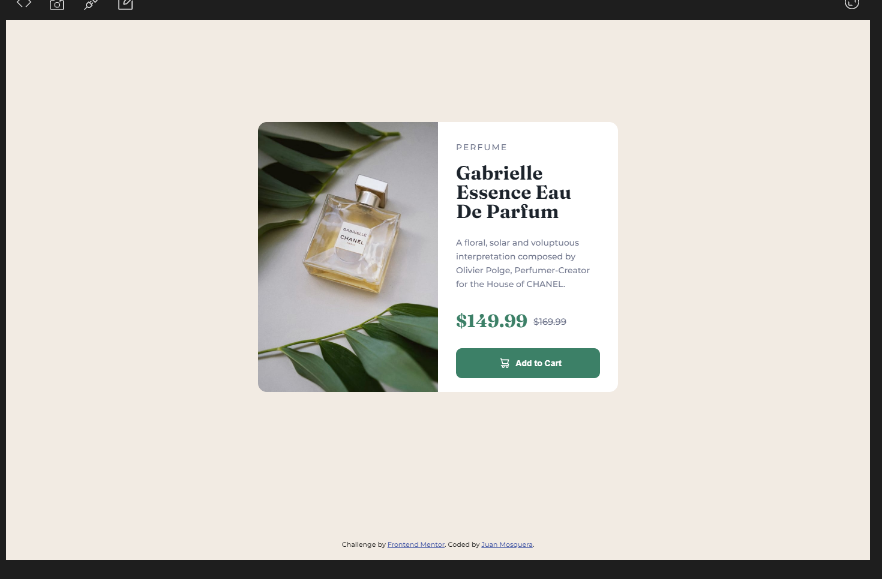

# Frontend Mentor - Product preview card component solution

Esta es una solución para [Product preview card component challenge on Frontend Mentor](https://www.frontendmentor.io/challenges/product-preview-card-component-GO7UmttRfa). Frontend Mentor challenges help you improve your coding skills by building realistic projects. 

## Table of contents

  - [The challenge](#the-challenge)
  - [Screenshot](#screenshot)
- [My process](#my-process)
  - [Built with](#built-with)
  - [What I learned](#what-i-learned)
  - [Continued development](#continued-development)
  - [Useful resources](#useful-resources)
- [Author](#author)
- [Acknowledgments](#acknowledgments)

### The challenge

Los usuarios deben ser capaces de:

- Ver el diseño óptimo según el tamaño de pantalla de su dispositivo
- Ver estados de desplazamiento y enfoque para elementos interactivos

### Screenshot

## My process

### Built with

- Semantic HTML5 markup
- CSS custom properties
- Flex
- Mobile-first workflow

## Author

- Linkedin - [Juan Mosquera](https://www.linkedin.com/in/juanmosquera98/)
- Frontend Mentor - [@yosoyteamc](https://www.frontendmentor.io/profile/Yosoyteamc)
- Instagram - [@yosoyteamc](https://www.instagram.com/yosoyteamc/)

